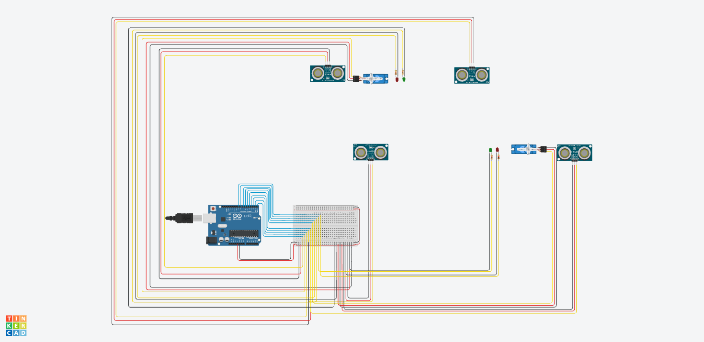

# Automated Vehicle Instruction System for Men's Hostel Entrance (Vellore Institute of Technology)

## Description:
Near Foodies, there is a subway entrance leading to a men's hostel. However, there is a problem that requires a solution. Two security guards are stationed at this entrance, regardless of the weather conditions, whether it's raining or sunny. Their primary responsibility is to provide instructions to vehicles approaching the entrance, either to stop or proceed.

To address this issue, an automated vehicle instruction system using ultrasonic sensors will be implemented. The system will be capable of sensing approaching vehicles and signaling instructions accordingly, eliminating the need for constant human presence.

## Solution Overview:
The proposed solution involves installing ultrasonic sensors at strategic locations near the entrance to detect the presence of vehicles. Ultrasonic sensors emit high-frequency sound waves and measure the time it takes for the waves to bounce back after hitting an object. By analyzing the reflected sound waves, the system can determine the distance between the sensor and the vehicle, thus allowing it to detect approaching vehicles accurately.

The system will be designed to consider various scenarios, including vehicles approaching at different speeds, in different weather conditions, and from different directions. It will have the capability to adjust the sensitivity of the sensors based on weather conditions such as rain or strong sunlight, ensuring reliable and accurate detection.

Based on the sensor readings, the system will identify when a vehicle comes closer, and will then open the gate for the vehicle to pass. For instance, when a vehicle is detected, the system may trigger a red traffic light signal to indicate that the vehicle should stop. Conversely, when no vehicle is detected or after a specified waiting time, the system may trigger a green traffic light signal, indicating that the vehicle can proceed.

## Components Required:
1. Arduino Uno R3 – 1 piece
2. Ultra-sonic sensor – 4 pieces
3. Servo motor – 2 pieces
4. Breadboard – 1 piece
5. Male to male wires and female to male wires

## ThinkerCAD Link

    ```markdown
        [Click here to view the main circuit on Tinkercad](https://www.tinkercad.com/things/ePhyYnKkCGO-main-circuit)
    ```


    ```markdown
        
    ```

    ```markdown
        
    ```

## Design

1. Circuit
    
2. Circuit Flow chart
    

## Demo Video link

1. Click here 

For more details you can view my ./21BIT0564_project_description.pdf file.
